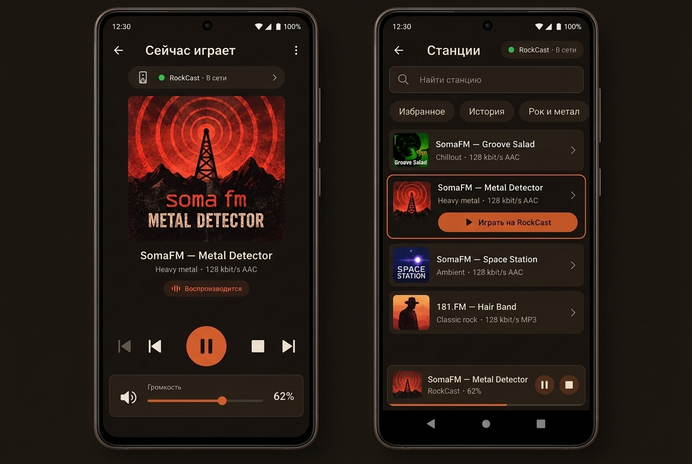

# ТЗ: достоверное управление проигрыванием RockCast из RockMobile

**Статус:** локальная реализация RS-8/RS-9, RC-4/RC-4b и RM-4 готова;
физическая USB-приёмка обновлённой server-to-target доставки ещё не выполнена;
**ревизия UX — 2026-09-17:** модель «Mini-Player + Bottom Sheet» (Концепция 2) заменена
на **Station-First** (единый каталог станций → экран станции с селектором устройства
вывода и пультом). Мокапы Концепции 2 ниже сохранены как исторический референс палитры.
**Исполнители:** RockServer (контракт и directory projection), RockCast (источник
фактического state), RockMobile (модель и UI)  
**Предпосылки:** RS-3, DC-013, DC-015, DC-016 и RC-3 завершены.  
**Необходимая последовательность:** для новой station presentation сначала
выпустить совместимый RockCast, затем RockServer; directory projection и
RockMobile уже реализованы локально. После этого — физическая приёмка.



> **Интерактивная HTML-витрина всех концепций:** [docs/live-control-mockups.html](../live-control-mockups.html) — полностью автономный интерактивный файл для демонстрации со звуковой симуляцией радио и кликабельными контролами.

## 1. Цель и граница результата

Когда пользователь выбирает станцию на телефоне и явный target `RockCast`, на
этом target должна стартовать именно выбранная станция. Телефон должен показывать
не предполагаемый результат нажатия, а последнее свежее состояние устройства:

- какую станцию устройство подтвердило как текущую;
- воспроизводится ли она, буферизуется, остановлена или произошла ошибка;
- фактическую громкость и mute, включая изменения, сделанные в окне RockCast;
- онлайн/устаревшее состояние target и ожидаемое состояние команды;
- индикацию живого вещания (Live radio) без вводящих в заблуждение элементов
  перемотки (seek/timeline).

Первый релиз не требует получения названия трека из радиопотока. «Что играет» в
этом ТЗ означает подтверждённую станцию: `station_id` из state сопоставляется с
уже существующим каталогом, из которого Mobile берёт название, обложку, жанр и
битрейт. Это не меняет source of truth: server-to-target delivery также несёт
bounded display name, чтобы именно RockCast не показывал UUID, если у него нет
локальной карточки. Если карточки станции нет в локальном каталоге Mobile, UI
показывает безопасный fallback «Станция <id>», а не прошлый выбранный
пользователем текст.

## 2. Фактическая исходная точка

- RockMobile уже отправляет `station.play_station` только на явно выбранный,
  online/fresh target с `media.control` и `media.station` (`rockserver_catalog`).
- RS-3 на RockServer валидирует station в каталоге и пересылает target-у
  `station.play_stream` с тем же command ID. Stream URL не возвращается Mobile.
- RockCast уже располагает реальным состоянием собственного player и volume;
  RC-3 подтвердил с телефона `playback.stop` на физическом target-е.
- Протокол v1 задаёт revisioned runtime state и `PlaybackRuntimeState`
  (`status`, `station_id`), а также volume. RS-8 уже добавил его owner-scoped
  в существующие `DeviceControlDirectoryEntry` REST/WSS snapshot/upsert;
  controller получает state без второго transport-а или polling endpoint-а.
- Визуальный стиль обоих клиентов зафиксирован в дизайн-системе: тёплая тёмная
  палитра «RockCast espresso» (`#1A1410` фон, `#241C16` панели, `#E8DCC8` текст,
  `#C45C26` терракотовый акцент). Мокапы приведены в полное соответствие с этой
  палитрой и одноэкранным каркасом каталога RockMobile.
- `media.chromecast` и `media.relay` **не рекламируются** после RC-3, потому что
  сервер пока не умеет их маршрутизировать. Они не входят в эту работу; их
  prerequisite — RS-7.

## 3. Неизменяемые правила протокола и безопасности

1. Единственный внешний путь выбора станции — `station.play_station`.
   `station.play_stream` — внутренняя server-to-target доставка после каталоговой
   валидации, не public UI action.
2. Не добавлять другой WebSocket, REST endpoint, device secret, pairing или
   controller identity. Использовать существующие directory/control session,
   ownership, scopes, command lifecycle и state revision/resync.
3. Ни stream URL, ни authorization header, ни device credential не попадают в
   Mobile state, command result, логи или mock/fixture.
4. `command.result: succeeded` означает лишь, что команда terminally accepted по
   текущему lifecycle. Он **не** заменяет state confirmation и не должен
   немедленно рисовать «Воспроизводится».
5. Server-derived identity, ownership/scope checks, capability checks,
   idempotency и frozen error codes сохраняются. Не ослаблять stale/offline
   protection ради UI.
6. Не публиковать без контракта неограниченные ICY/stream metadata (название
   трека, URL обложки или произвольные теги). Это отдельное, bounded расширение
   после v1; оно не маскируется под `station_id`.
7. Никаких ложных элементов перемотки (scrub/seek bar) для радиопотока. Плеер
   отображает статус живого вещания и реальные доступные команды (`play`, `pause`,
   `stop`, переключение станций).

### 3.1 Bounded presentation in the server-to-target delivery (RS-9 / RC-4b)

После server-side каталоговой резолюции target получает
`station.play_stream { station_id, station: { name, icon_url }, stream_uri }`.
`station_id` — единственная идентичность playback/runtime state; `name` — только
отображение в RockCast. Ни Mobile, ни directory state, command lifecycle,
persisted controller input или логи не получают этот presentation-object и не
получают `stream_uri`.

`icon_url` зарезервирован как nullable bounded HTTP(S) URL. Пока RockServer не
хранит иконки каталога, он всегда отправляет `null`; RockCast не придумывает
обложку из stream URL. Когда поле появится в каталоге, оно пройдёт прежнюю
валидацию безопасного публичного URL на сервере и существующую bounded очередь
иконок RockCast — без нового endpoint-а и передачи списка станций.

**Совместимое развёртывание:** сначала обновить RockCast до RC-4b (он принимает
старую доставку без `station` и имеет fallback), затем развернуть RS-9. Старый
строгий parser RockCast отвергает новое поле, поэтому обратный порядок запрещён.

**Фактическое состояние 2026-09-17:** по явному запросу владельца RS-9 уже
развёрнут как `509ea0c` (VPS `status=succeeded`, public readiness `200`). RC-4b
закоммичен, но ещё не установлен на Windows-таргете; до его запуска нельзя
проверять `station.play_station` с телефона на старом строгом parser-е. Это
временное rollout-отклонение, а не физическая приёмка.

## 4. Требуемая модель состояния

### 4.1 Авторитетность и свежесть

`DeviceRuntimeState` из серверной directory projection — единственный источник
истины для видимых playback/volume значений. Mobile хранит отдельно:

| Тип | Содержимое | Для чего нельзя использовать |
| --- | --- | --- |
| `lastConfirmedState` | пришедший от RockServer revisioned state snapshot (`state_revision`, `observed_at`, `playback`, `volume`) + presence/freshness | не заменять им локальный pending intent |
| `pendingIntent` | command ID, запрошенная station/volume, время отправки, ревизия на момент отправки | не выдавать за реальные playing/volume |
| `cataloguePresentation` | название, artwork, genre, bitrate по подтверждённому `station_id` | не доказывать этим, что устройство играет |

State считается пригодным для interactive control, только если target online,
fresh и имеет допустимые role/scope/capability. На reconnect Mobile делает
обычный directory snapshot/resync; не пытается восстановить state из старого
optimistic UI.

### 4.2 Минимальная v1 проекция в OpenAPI

`api/openapi.yaml` фиксирует, что текущий `DeviceControlDirectoryEntry` не
содержит runtime state; это обязательное server-contract amendment. Для данного
объёма `DeviceControlDirectoryEntry` дополняется опциональным полем
`runtime_state`:

```yaml
DeviceControlDirectoryEntry:
  properties:
    # ... существующие поля (device_id, presence, capabilities, state_freshness) ...
    runtime_state:
      $ref: "#/components/schemas/DeviceStateSnapshot"
      description: >-
        Owner-scoped current runtime state snapshot including state_revision and observed_at.
        Null or absent if the target has not published state or if caller lacks scope.
```

Внутри `DeviceStateSnapshot` controller получает:
- `state_revision: u64` — строго монотонная ревизия устройства (критически
  необходима клиенту для разрешения гонок и упорядочивания эхо-событий);
- `observed_at: Timestamp` — время наблюдения состояния устройством;
- `state.playback`:
  - `status`: enum `[idle, buffering, playing, paused, stopped, error]`
  - `station_id`: nullable exact catalog station ID
- `state.volume`:
  - `level`: integer `0..100` (bounded canonical percent)
  - `muted`: boolean

Названия enum, nullability и числовая шкала берутся из действующего OpenAPI. Если
target не публиковал state (или старый target не поддерживает его), поле
`runtime_state` отсутствует/null. Клиенты интерпретируют это как «нет данных»,
а не подставляют фиктивные `stopped` или 0%.

### 4.3 Когда RockCast обязан публиковать state

RockCast публикует initial complete state после успешной регистрации и после
resync. Затем он увеличивает revision и публикует изменение только после того,
как изменился физический/устойчивый факт, в частности:

- принятая `station.play_stream` начала загрузку (`buffering`, exact station ID);
- player перешёл в `playing`, `paused`, `stopped`, `idle` или `error`;
- станция не стартовала либо поток завершился/сломался — error state должен
  отличаться от успеха и сохранять station ID, если он известен;
- remote command или локальный UI RockCast изменил volume/mute/output;
- локальный выбор станции или transport-кнопка RockCast изменила player state.

Дубли state без фактического изменения не должны бесконечно поднимать revision.
Окончательный `command.result` отправляется существующим lifecycle, но state
публикуется независимо от порядка его доставки. На network reconnect current
complete state должен позволять Mobile догнать устройство без истории команд.

### 4.4 Матрица согласования состояний (State Reconciliation Matrix)

Презентационный редьюсер RockMobile разрешает гонки между локальными действиями,
терминальными результатами команд и авторитетным состоянием устройства по
следующим правилам:

| Текущее состояние Mobile | Входящее событие | Результирующее состояние UI | Пояснение |
| :--- | :--- | :--- | :--- |
| `pendingIntent(Station A)` | `stateUpdate(station_id=A, status=buffering)` | `Buffering(Station A)` | RockCast принял команду и начал буферизацию. |
| `pendingIntent(Station A)` | `stateUpdate(station_id=A, status=playing)` | `Playing(Station A)` | Успех: физическое воспроизведение подтверждено. `pendingIntent` очищается. |
| `pendingIntent(Station A)` | `stateUpdate(station_id=B, rev > cmd_rev)` | `Playing(Station B)` + уведомление | **Внешнее переопределение**: на ПК или другом пульте выбрана станция B. `pendingIntent` сбрасывается немедленно, не дожидаясь 10с таймаута. |
| `pendingIntent(Station A)` | `stateUpdate(status=stopped, rev > cmd_rev)` | `Stopped` + сброс intent | Плеер был остановлен локально на ПК. |
| `pendingIntent(Station A)` | `command.result: succeeded`, но state старый | `Ожидаем подтверждения…` | Защита от optimistic UI: терминальный успех подтверждает лишь приём команды. Ждём эхо-состояние от плеера. |
| `pendingIntent(Station A)` | `command.result: failed / expired` | `Ошибка команды` + `Повторить` | Команда не выполнена. Отображается ошибка и кнопка ручного повтора. |
| `isDraggingVolume = true` | Входящий `stateUpdate(volume)` | Ползунок под пальцем остаётся стабильным | **Защита от джиттера**: во время активного жеста сетевые обновления не сдвигают ползунок под пальцем. |
| Завершение drag громкости (`onValueChangeFinished`) | Отправка `volume.set_volume` | Индикатор `Применяем…` | Отправляется ровно один запрос на отпускание пальца; значение фиксируется по приходу эхо-state. |

### 4.5 Жизненный цикл ошибок и остановки в RockCast (RC-4)

1. **Ошибка открытия потока / разрыв сети**: если RockCast не может открыть поток
   (DNS failure, HTTP 404/503, сокет закрыт, ошибка кодека), плеер переходит в
   `status: error`. Значение `station_id` **сохраняется** (не сбрасывается в null),
   чтобы телефон понимал, какая именно станция вызвала сбой, и мог предложить
   повтор.
2. **Остановка по кнопке Stop**: переход в `status: stopped`. Последний
   `station_id` сохраняется до выбора новой станции.
3. **Пауза не поддерживается (решение 2026-09-17):** RockCast управляет только
   `play` и `stop`; `playback.pause` не рекламируется в манифесте и не
   обрабатывается. Статус `paused` остаётся в enum протокола для будущих
   target-ов, но RockCast v1 его не публикует, а RockMobile не показывает кнопку
   Pause для таргетов без action `pause` (capability-driven UI).

## 5. UX и эргономика RockMobile (ревизия Station-First, 2026-09-17)

Навигация строится от музыки к устройству: пользователь сначала выбирает станцию
в едином каталоге, а устройство вывода выбирает на экране этой станции. Выбор
устройства не «размазан» по строкам каталога.

### 5.1 Главный экран: единый каталог станций (`StationCatalogScreen`)

1. **Header**: поле поиска «Найти станцию» и чипы быстрых жанров/избранного.
2. **Список станций**: чистый список радиостанций (логотип, название, жанр,
   битрейт, кнопка добавления в избранное). В строках **нет** кнопок выбора
   конкретного устройства — список сфокусирован на музыке.
3. **Клик по строке станции** открывает **экран станции** (`StationPlayerScreen`).
4. **Sticky mini-player (снизу)**: отображается, только если сейчас что-то играет
   (на RockCast или на самом телефоне): логотип, название станции, устройство и
   громкость (`RockCast · 62%`), кнопки `Play` и `Stop`. Тап по мини-плееру
   разворачивает экран текущей (подтверждённой) станции. Внутри мини-плеера
   **нет** горизонтального ползунка громкости (жестовая безопасность).

### 5.2 Экран станции и пульта (`StationPlayerScreen`)

- **Header**: кнопка `← Назад` в каталог и кнопка «В избранное».
- **Hero-обложка**: крупный квадратный логотип станции, название, жанр и битрейт
  (`Heavy Metal · 128 kbit/s AAC`).
- **Селектор устройства вывода (Device Selector)**:
  - интерактивный бейдж под обложкой: `Играть на: [ 💻 RockCast · В сети ▼ ]`
    либо `📱 Этот телефон`;
  - по нажатию открывается диалог со списком обнаруженных устройств директории
    (с индикаторами `В сети` / `Нет связи` и fresh/stale статусом);
  - если выбранное устройство офлайн или state устарел — действие запуска
    блокируется с кратким пояснением причины (нет `media.control`/`media.station`,
    offline, stale).
- **Индикатор прямого эфира**: бейдж `● В ЭФИРЕ · Воспроизводится` с анимацией
  волны. **Строго без** таймлайна, шкалы перемотки (seek/scrub bar) и счётчиков
  времени `0:00 / -:--`.
- **Блок управления (Transport)**:
  - `Предыдущая станция` (|◀) и `Следующая станция` (▶|) — переход по каталогу;
  - крупная акцентная кнопка `Play` (▶); кнопка `Pause` не показывается для
    таргетов без action `pause` (RockCast его не рекламирует);
  - `Stop` (⏹) — остановка потока и освобождение аудиоустройства;
  - действия доступны только при наличии соответствующих capabilities таргета.
- **Блок громкости выбранного устройства**:
  - карточка со значком динамика, кнопкой Mute, горизонтальным слайдером 0..100%
    и числовым процентом (`62%`);
  - отображает и регулирует громкость выбранного таргета (для телефона —
    локальная громкость);
  - во время жеста (`isDraggingVolume = true`) сетевые эхо-события не сдвигают
    ползунок под пальцем;
  - `volume.set_volume` отправляется однократно при отпускании пальца
    (`onValueChangeFinished`); при ожидании эха отображается метка `Применяем…`.
- **Единый источник истины**: мини-плеер и `StationPlayerScreen` подключены к
  одному `StateFlow`/репозиторию; при внешнем переключении станции на ПК экран
  немедленно разворачивается к фактически подтверждённой станции (матрица §4.4).

## 6. Декомпозиция для другого агента

### Phase 0 — directory state contract и fixtures (RockServer, обязательная gate)

> **Реализация (RockServer, RS-8, 2026-09-17):** пункт 1 контракта и фикстур реализован —
> `DeviceControlDirectoryEntry` получил опциональный owner-scoped `runtime_state`
> (`$ref DeviceStateSnapshot`), обновлены `directory-snapshot-server.json` и добавлена
> золотая `directory-upsert-server.json`; контрактные тесты подтверждают gate. Пункт 3
> (полный набор fixture-сценариев buffering→playing/stopped/error/stale) покрывается
> поштучно по мере готовности клиентов; physical acceptance не выполнялась.

1. Зафиксировать current-gap: `DeviceControlDirectoryEntry` экспортирует
   `state_freshness`, но не `runtime_state`. Добавить минимальную
   owner-scoped runtime-state проекцию (`DeviceStateSnapshot`, содержащий
   монотонную `state_revision`, `observed_at` и `DeviceRuntimeState`) к
   existing directory REST snapshot и WSS upsert, с ясной null/absence semantics
   для target-а без state.
2. Сначала изменить OpenAPI, references и normalized fixtures, затем Rust DTO и
   fan-out. Сохранить directory revision/resync semantics; state revision остаётся
   revision устройства, а не новым command ID.
3. Зафиксировать fixture-сценарии: initial playing station + volume, station
   change buffering→playing, local volume change, stopped/error, stale/offline,
   старый target без optional field.
4. Не менять station resolver, pairing или auth. В status/tasks отметить exact
   outcome контракта.

**Gate:** fixture и OpenAPI contract test доказывают, что owner controller видит
revisioned runtime state в обычном directory snapshot/upsert; не-owner не видит
запись и отсутствие state не становится fabricated playback value.

### Phase 1 — truthful publisher (RockCast, RC-4)

> **Реализация (RockCast, RC-4, 2026-09-17):** полные статусы
> `buffering/playing/stopped/error` (Idle после запуска = stopped), точный
> `station_id` привязан к lifecycle запуска и сохраняется в error/stopped,
> монотонная персистентная ревизия; пауза не поддерживается (см. §4.5.3).
> Fake-transport тесты покрывают все переходы и resync; `cargo test` 129+2/0.
> **Дополнение RC-4b (2026-09-17):** server-delivered fallback использует
> `station.name`, но сохраняет exact `station_id`; готов принять nullable
> `icon_url` через существующую bounded очередь иконок. `cargo test` 131+2/0.

1. Найти единственный owner player state и volume state; не создавать второй
   shadow player для control worker.
2. Связать initial snapshot, remote `station.play_stream`/playback/volume
   commands и локальные player events с publisher-ом §4.3 и жизненным циклом §4.5.
3. Передавать exact server-resolved station ID через start lifecycle до terminal
   state; не восстанавливать ID из stream URL; сохранять station ID при переходе в `error`.
4. Добавить deterministic unit tests с fake player/control transport:
   startup snapshot, requested station, failed start, stop/pause, local/remote
   volume, monotonic revision/no duplicate and reconnect resync.
5. Обновить `rockcast/docs/status.md` и `rockcast/docs/tasks.md`, не публикуя
   secrets в diagnostics.

**Gate:** на fake transport подтверждено, что все видимые изменения состояния
порождают correct revisioned state, а command success сам по себе не служит
подтверждением playing.

### Phase 2 — directory state projection implementation (RockServer, RS-8)

> **Реализация (RockServer, RS-8, 2026-09-17):** проекция включена в существующие
> REST directory snapshot и WSS `directory.snapshot`/`directory.upsert` без новых
> endpoints/polling; гейт по `entity.state.read`, absent-семантика для target-а без
> state и защита от «воскрешения» ранних ревизий покрыты детерминированными тестами.
> Проверки чужого аккаунта на живой инсталляции и физическая приёмка не выполнялись.

1. Реализовать утверждённую Phase 0 projection в уже существующих directory
   snapshot/upsert; сохранить resync/revision semantics и отсутствие нового
   polling endpoint.
2. Добавить router/API tests, что чужой аккаунт, revoked/expired session и stale
   target не получают/не превращают в fresh чужой state.
3. Обновить серверные status/task log и this roadmap с итоговым решением.

**Gate:** Android-клиент получает current full state через обычный directory
snapshot и последующие upsert после restart/reconnect, без polling нового endpoint.

### Phase 3 — state-driven UI (RockMobile, RM-4)

> **Реализация (RockMobile, RM-4, 2026-09-17):** `LivePlaybackReducer` +
> `LivePlaybackStore` (полная матрица §4.4), `StationPlayerScreen` с селектором
> устройства вывода, `LiveMiniPlayer`, каталог без per-device кнопок;
> `testDebugUnitTest` 129/0 (16 reducer-тестов), `lintDebug`, `assembleDebug`.

1. Расширить existing directory DTO/repository/store ровно до contract fields;
   unknown optional fields tolerant, отсутствующее поле — `Unknown`, не default.
2. Ввести единый presentation reducer из `lastConfirmedState`, `pendingIntent`
   и каталога с полной реализацией матрицы согласования §4.4 (немедленный сброс
   intent при внешнем переопределении на ПК, изоляция `isDraggingVolume` от
   сетевого джиттера). Не размазывать optimistic flags по StationRow,
   PlayerScreen и DeviceControlScreen.
3. Реализовать Station-First навигацию и UI по §5 (ревизия 2026-09-17):
   `StationCatalogScreen` (единый каталог с поиском, без per-device кнопок в
   строках), `StationPlayerScreen` (hero, селектор устройства вывода
   `Играть на: [ RockCast ▼ ]`, transport, индикатор эфира, громкость с
   drag-изоляцией) и sticky mini-player, используя существующий target selection
   и command lifecycle.
4. Реализовать volume commit-on-release и reconciling server value. Любые command
   controls capability-driven; relay/Cast не добавлять.
5. Тестировать reducer/UI: matching/different station ID, buffering/playing,
   terminal success before state, terminal failure, stale/offline, local volume
   overwrite, missing catalog record, reconnect snapshot.
6. Обновить `rockmobile/docs/status.md`, `rockmobile/docs/tasks.md` и central
   `rock-esp32/docs/plan-control.md` с evidence выполнения.

**Gate:** unit/UI tests доказывают, что Mobile никогда не объявляет выбранную
станцию playing лишь по tap или terminal command result.

### Phase 4 — интеграция и физическая приёмка

> **Статус (центр управления, 2026-09-17):** offline-верификация выполнена —
> юнит-тесты всех трёх репозиториев, кросс-репозиторная проверка golden-фикстур
> RS-8 реальным парсером RockMobile (runtime_state Known/Unknown декодируется
> корректно), `assembleDebug` APK собран. Физическая USB-приёмка пунктов 1–4
> ниже НЕ выполнена и не заявляется; выполняется владельцем по этому чек-листу.

1. Запустить one current RockCast instance, дождаться online/fresh directory
   state на USB-connected Android device.
2. Выбрать две отличающиеся catalog stations подряд и проверить exact
   `station_id`/название на телефоне после каждой команды, а для станции вне
   локального cache RockCast — её человеческое `station.name` (не UUID) в
   `Now playing` на ПК. Зафиксировать, что текущая иконка корректно отсутствует:
   `icon_url` от сервера сейчас `null`.
3. Изменить volume с телефона, затем локально в RockCast; после каждого изменения
   убедиться, что телефон показывает device-confirmed значение.
4. Проверить stop/pause/play и failure path (без ложного success), offline/stale
   command gating и catch-up после reconnect.
5. Сохранить только безопасные результаты: тест station ID, revision, status,
   volume и error code; не логи URL/token.

## 7. Приёмка результата

Работа считается завершённой только когда выполнены все условия:

- Выбор станции A на Mobile для explicit RockCast приводит к fresh confirmed
  state с A; выбор B затем не оставляет на UI A, если устройство подтвердило B
  либо ошибку.
- Терминальный `succeeded` до обновления state остаётся «Ожидаем подтверждения»,
  а не «Воспроизводится».
- Playback и volume изменённые локально в RockCast отражаются на Mobile через
  обычную state projection; изменение с Mobile показывается после device echo.
- Offline/stale/no-capability target не получает команду и UI объясняет причину.
- Никакой новый direct stream path, auth material, unbounded stream metadata,
  relay или Chromecast control не добавлен.
- Контрактные fixture/API tests, RockCast focused tests, RockMobile unit/UI tests
  и физическая USB E2E выполнены последовательно. Документация всех трёх
  репозиториев и central plan содержит дату, checks и результат.

## 8. Риски и решения

| Риск | Решение |
| --- | --- |
| Optimistic UI показывает не ту станцию | Pending intent отделён от confirmed state; station ID обязан совпасть |
| Каталог не содержит ID после reconnect | Безопасный fallback по ID, без старого UI title |
| Частые slider events перегружают command lifecycle | Один bounded commit на завершение drag; state echo authoritative |
| Дрожание слайдера громкости во время жеста | Флаг `isDragging`: сетевые обновления не двигают ползунок, пока палец на экране |
| Локальный RockCast выбирает станцию во время pending | Свежая ревизия с другим `station_id` немедленно аннулирует `pendingIntent` как Superseded |
| Локальный RockCast меняет громкость | Входящий fresh revision отменяет pending display и показывает actual value |
| Старый device не публикует поле | `Unknown` и disabled/neutral UI, не fabricated stopped/zero |
| Расширение уходит в Cast/relay | Явно не входит; ждать RS-7 |

## 9. Обязательная документация по завершении каждой фазы

- RockServer: `docs/status.md`, `docs/tasks.md`, этот файл и при изменении wire
  shape `api/openapi.yaml` + fixtures.
- RockCast: `docs/status.md`, `docs/tasks.md`.
- RockMobile: `docs/status.md`, `docs/tasks.md`.
- Центральный контрольный план: `rock-esp32/docs/plan-control.md`.

Запись должна различать planned, implemented и physically accepted; не помечать
Phase 4 выполненной по одному лишь unit test.
